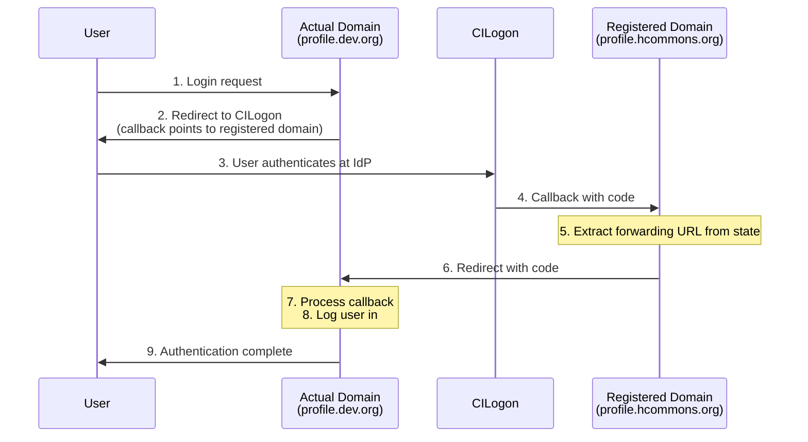
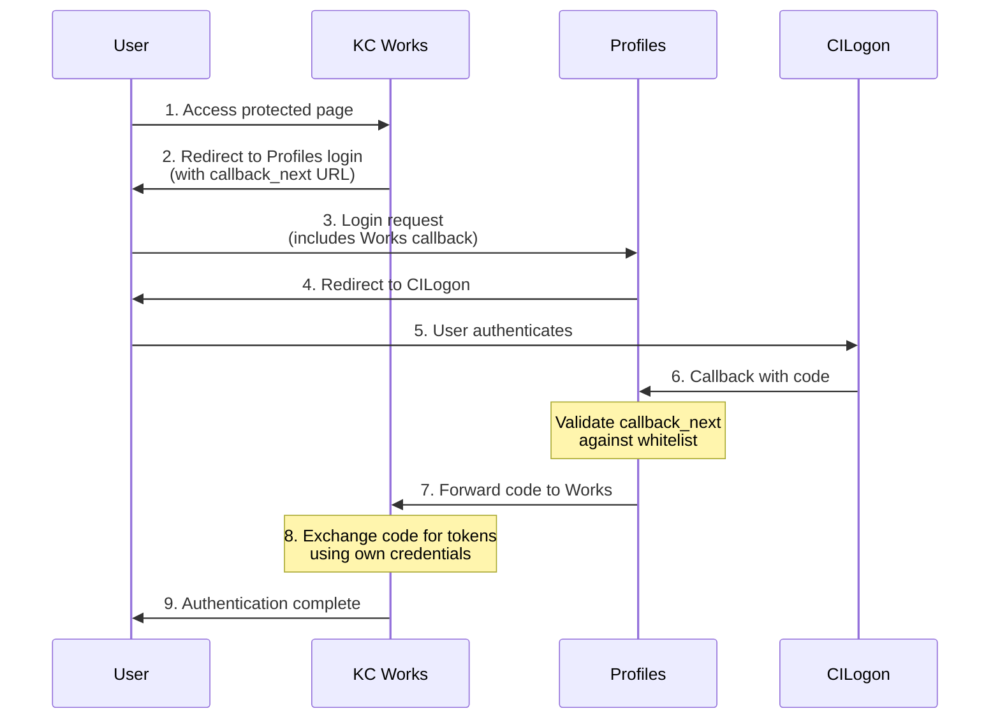

# CILogon Proxy and Forwarding Guide

> **Note**: This documentation refers to knowledge-commons-profiles version 3.15.0

## Overview

The Knowledge Commons Profiles application supports OAuth proxy and forwarding functionality that enables two key use cases:

1. **Domain Proxy**: Running staging/development environments that share OAuth credentials with production
2. **Service Forwarding**: Allowing other services in the ecosystem to authenticate users through Profiles

This guide explains how these mechanisms work and how to configure them.

## Domain Proxy

### Purpose

CILogon requires that OAuth callback URLs be pre-registered. This creates a challenge for staging and development environments that need to use the same OAuth credentials as production but run on different domains.

The domain proxy feature solves this by:
- Using the registered (production) domain for OAuth callbacks
- Forwarding the OAuth response back to the actual (staging/dev) domain

### How It Works



### Configuration

Configure domain proxy with these environment variables:

#### CILOGON_REGISTERED_DOMAIN
- **Purpose**: The domain registered with CILogon for OAuth callbacks
- **Default**: "profile.hcommons.org"
- **Example**: `CILOGON_REGISTERED_DOMAIN=profile.hcommons.org`

#### CILOGON_ACTUAL_DOMAIN
- **Purpose**: The domain this instance actually runs on
- **Default**: "" (empty, meaning no proxy is used)
- **Example**: `CILOGON_ACTUAL_DOMAIN=profile.hcommons-dev.org`

When `CILOGON_ACTUAL_DOMAIN` is set and differs from `CILOGON_REGISTERED_DOMAIN`, the proxy is automatically enabled.

### Implementation Details

The proxy mechanism is implemented in `oauth.py`:

1. **`is_using_domain_proxy()`**: Returns True if actual domain differs from registered domain

2. **`get_oauth_redirect_uri(request)`**: Builds the OAuth redirect URI, substituting the registered domain when proxy is enabled

3. **`get_forwarding_state_for_proxy()`**: Encodes the actual domain's callback URL in the OAuth state parameter

4. **`is_request_from_actual_domain(request)`**: Detects if the callback request came to the actual domain (meaning forwarding already happened)

5. **`forward_url(request)`**: Extracts the forwarding URL from state and returns a redirect response

### Example Configuration

For a staging environment at `profile.hcommons-staging.org` sharing credentials with production:

```bash
CILOGON_CLIENT_ID=cilogon:/client_id/production_id
CILOGON_CLIENT_SECRET=production_secret
CILOGON_REGISTERED_DOMAIN=profile.hcommons.org
CILOGON_ACTUAL_DOMAIN=profile.hcommons-staging.org
```

The staging instance will:
1. Send OAuth requests with callback URL pointing to `profile.hcommons.org`
2. Encode `profile.hcommons-staging.org/cilogon/callback/` in the state
3. Production receives the callback and forwards to staging
4. Staging processes the OAuth response and logs the user in

## Service Forwarding

### Purpose

Other services in the Knowledge Commons ecosystem (like KC Works) may need to authenticate users without implementing their own CILogon integration. The service forwarding feature allows these services to:

1. Redirect users to Profiles for authentication
2. Receive the OAuth authorization code after successful authentication
3. Exchange the code for tokens using their own backend

### How It Works



### Configuration

#### ALLOWED_CILOGON_FORWARDING_DOMAINS

Controls which domains can receive forwarded OAuth codes.

- **Type**: List of domain names
- **Default**: `["hcommons.org", "msu.edu", "localhost", "lndo.site", "hcommons-staging.org", "hcommons-dev.org"]`
- **Example**: `ALLOWED_CILOGON_FORWARDING_DOMAINS=hcommons.org,msu.edu,example.org`

Only domains in this whitelist can receive forwarded authorization codes. This is a security measure to prevent OAuth code interception attacks.

### Initiating a Forwarded Authentication

External services initiate forwarded authentication by redirecting users to the Profiles login endpoint with a callback URL encoded in the state:

```python
import base64
import json

# The URL where Profiles should forward the OAuth code
callback_url = "https://works.hcommons.org/oauth/callback"

# Encode as state parameter
state = base64.urlsafe_b64encode(
    json.dumps({"callback_next": callback_url}).encode()
).decode()

# Redirect user to Profiles login
login_url = f"https://profile.hcommons.org/cilogon/login/?state={state}"
```

### Security Considerations

1. **Domain Whitelist**: Only domains in `ALLOWED_CILOGON_FORWARDING_DOMAINS` can receive forwarded codes. The system extracts the base domain (ignoring subdomains) for validation.

2. **TLD Extraction**: The system uses `tldextract` to properly parse domains, handling edge cases like `co.uk` suffixes.

3. **Code Forwarding Only**: Only the authorization code is forwarded. The receiving service must exchange the code for tokens using its own client credentials.

4. **State Validation**: Invalid or malformed state parameters are rejected, and the user proceeds with normal Profiles authentication.

### Implementation Details

The forwarding mechanism in `oauth.py`:

1. **`extract_code_next_url(request)`**: Decodes the state parameter and extracts `callback_next` URL

2. **`generate_next_url(code, next_url, request)`**: Builds the forwarding URL with the OAuth code and state

3. **`forward_url(request)`**: Main forwarding logic:
   - Extracts callback URL from state
   - Validates domain against whitelist
   - Returns redirect response if valid, None otherwise

### Example: KC Works Integration

KC Works authenticates users through Profiles:

1. **Works redirects to Profiles**:
   ```
   https://profile.hcommons.org/cilogon/login/?state=eyJjYWxsYmFja19uZXh0IjoiaHR0cHM6Ly93b3Jrcy5oY29tbW9ucy5vcmcvb2F1dGgvY2FsbGJhY2sifQ==
   ```

2. **Profiles authenticates user via CILogon**

3. **Profiles forwards code to Works**:
   ```
   https://works.hcommons.org/oauth/callback?code=AUTH_CODE&state=...
   ```

4. **Works exchanges code for tokens** using its own CILogon client credentials

## Combining Proxy and Forwarding

Both mechanisms can work together. For example, if a staging Profiles instance receives a forwarding request:

1. User at Works (staging) clicks login
2. Works redirects to Profiles (staging) with callback_next
3. Profiles (staging) redirects to CILogon with registered domain callback
4. CILogon redirects to Profiles (production) with code
5. Profiles (production) forwards to Profiles (staging) based on state
6. Profiles (staging) forwards to Works (staging) based on callback_next

The system handles nested forwarding by checking `is_request_from_actual_domain()` to determine whether to forward or process the callback.

## Troubleshooting

### Forwarding Not Working

1. **Check domain whitelist**: Ensure the target domain is in `ALLOWED_CILOGON_FORWARDING_DOMAINS`
2. **Check state encoding**: Verify the state is properly base64-encoded JSON with `callback_next` key
3. **Check logs**: Look for "Disallowed CILogon code forwarding URL" warnings

### Proxy Not Working

1. **Verify domain settings**: Ensure `CILOGON_ACTUAL_DOMAIN` is set and differs from `CILOGON_REGISTERED_DOMAIN`
2. **Check registered domain deployment**: The production/registered domain must be running and accessible
3. **Check state parameter**: Ensure the forwarding URL is properly encoded in state

### Common Log Messages

- `"Forwarding CILogon code to X with state: Y"` - Successful forwarding initiated
- `"Disallowed CILogon code forwarding URL: X"` - Domain not in whitelist
- `"Exception parsing and validating next_url"` - Malformed callback URL
- `"Unspecified error parsing CILogon state"` - Invalid state parameter

## Related Documentation

- [CILogon Features Technical Guide](cilogon_features_technical_guide.md) - Full authentication flow documentation
- [CILogon OAuth Flow Diagram](cilogon_oauth_flow_diagram.md) - Visual flow diagram
- [Environment Variables Guide](../environment_variables_guide.md) - All configuration options
