# CILogon OAuth Flow Architecture Diagram

```mermaid
graph TB
    %% User and Browser
    User[👤 User] --> Browser[🌐 Browser]
    
    %% External Services
    CILogon[🔐 CILogon<br/>OAuth Provider<br/>cilogon.org]
    Works[📚 KC Works<br/>works.hcommons.org]
    WordPress[📝 WordPress<br/>HCommons/KCommons]
    
    %% Knowledge Commons Profiles App Components
    subgraph "Knowledge Commons Profiles App"
        direction TB
        
        %% Views and Controllers
        LoginView[🚪 cilogon_login<br/>views.py]
        CallbackView[↩️ callback<br/>views.py]
        RegisterView[📝 register<br/>views.py]
        LogoutView[🚪 app_logout<br/>views.py]
        
        %% OAuth Components
        OAuthClient[🔑 OAuth Client<br/>oauth.py]
        TokenManager[🎫 Token Manager<br/>TokenUserAgentAssociations]
        
        %% Models and Data
        Profile[👤 Profile Model]
        SubAssoc[🔗 SubAssociation<br/>Links CILogon sub to Profile]
        DjangoUser[👤 Django User]
        
        %% External Integrations
        Webhook[📡 Webhook Service<br/>Association Updates]
        
        %% Middleware
        RefreshMiddleware[🔄 AutoRefreshTokenMiddleware]
        GCMiddleware[🗑️ GarbageCollectionMiddleware]
    end
    
    %% WordPress Database
    WPDB[(🗄️ WordPress DB<br/>wordpress_dev)]
    
    %% Flow 1: Initial Login
    Browser -->|1 Login Request| LoginView
    LoginView -->|2 OAuth Authorization| CILogon
    CILogon -->|3 Authorization Code| CallbackView
    CallbackView -->|4 Exchange Code for Tokens| OAuthClient
    OAuthClient -->|5 Get User Info| CILogon
    
    %% Flow 2: User Registration/Association
    CallbackView -->|6a New User| RegisterView
    CallbackView -->|6b Existing User| Profile
    RegisterView -->|7 Create Profile & User| Profile
    RegisterView --> DjangoUser
    RegisterView -->|8 Link CILogon Identity| SubAssoc
    
    %% Flow 3: Token Management
    OAuthClient -->|9 Store Tokens| TokenManager
    RefreshMiddleware -->|10 Auto-refresh| TokenManager
    GCMiddleware -->|11 Cleanup Expired| TokenManager
    
    %% Flow 4: External System Integration
    SubAssoc -->|12 Association Event| Webhook
    Webhook -->|13 Notify KC Works| Works
    Webhook -->|14 Notify WordPress| WordPress
    
    %% Flow 5: WordPress Data Access
    Profile -->|15 Read WP Data| WPDB
    
    %% Flow 6: Multi-App Logout
    LogoutView -->|16 Revoke All Tokens| CILogon
    LogoutView -->|17 Clear Works Session| Works
    LogoutView -->|18 Clear WordPress Session| WordPress
    
    %% Styling
    classDef userStyle fill:#e1f5fe,stroke:#01579b,stroke-width:2px
    classDef externalStyle fill:#f3e5f5,stroke:#4a148c,stroke-width:2px
    classDef appStyle fill:#e8f5e8,stroke:#1b5e20,stroke-width:2px
    classDef dataStyle fill:#fff3e0,stroke:#e65100,stroke-width:2px
    classDef middlewareStyle fill:#fce4ec,stroke:#880e4f,stroke-width:2px
    
    class User,Browser userStyle
    class CILogon,Works,WordPress externalStyle
    class LoginView,CallbackView,RegisterView,LogoutView,OAuthClient,Profile,SubAssoc,DjangoUser,Webhook appStyle
    class WPDB,TokenManager dataStyle
    class RefreshMiddleware,GCMiddleware middlewareStyle
```

## Key Components & Flow Description

### 🔐 **CILogon OAuth Provider**
- **Discovery URL**: `https://cilogon.org/.well-known/openid-configuration`
- **Scopes**: `openid email profile org.cilogon.userinfo offline_access`
- **Logout URL**: `https://cilogon.org/logout`

### 🚀 **Authentication Flow**

1. **Login Initiation** (`cilogon_login`)
   - User clicks login → redirected to CILogon
   - State parameter includes next URL for post-auth redirect

2. **OAuth Callback** (`callback`)
   - Receives authorization code from CILogon
   - Exchanges code for access/refresh tokens
   - Validates JWT tokens and extracts user info

3. **User Registration/Association** (`register`)
   - New users: Creates Profile + Django User + SubAssociation
   - Existing users: Links CILogon identity to existing profile
   - Validates `cilogon_sub` before any user creation

4. **Session Management**
   - Stores tokens in `TokenUserAgentAssociations`
   - Auto-refresh middleware maintains token validity
   - Garbage collection cleans expired tokens

### 🔗 **External System Integration**

#### **KC Works Integration**
- **Endpoint**: `https://works.hcommons.org/` (production)
- **Purpose**: Scholarly works and publications management
- **Integration**: Webhook notifications on user association events

#### **WordPress Integration**
- **Database**: Direct connection to WordPress MySQL database
- **Router**: `ReadWriteRouter` manages read/write operations
- **Models**: `WpUser`, `WpPost`, `WpBlog` for WordPress data access
- **Purpose**: Legacy user data, blog posts, group memberships

### 🚪 **Multi-Application Logout**
- **Apps**: `["Profiles", "Works", "WordPress"]`
- **Process**: 
  1. Revokes all tokens at CILogon
  2. Clears sessions across all three applications
  3. Uses user-agent tracking for cross-app session management

### 🔒 **Security Features**
- **JWT Validation**: Custom `ORCIDHandledToken` for ORCID compatibility
- **Secure Parameter Encoding**: AES encryption for sensitive data transmission
- **Domain Validation**: Whitelist for allowed forwarding domains
- **Token Expiration**: 4-day token cleanup cycle

### 📡 **Webhook Integration**
- **Purpose**: Real-time association updates to external systems
- **Trigger**: When CILogon identity is linked to a profile
- **Recipients**: KC Works and WordPress receive association notifications
- **Security**: Uses `WEBHOOK_TOKEN` for authentication

This architecture provides seamless single sign-on across the Knowledge Commons ecosystem while maintaining security and proper token lifecycle management.
